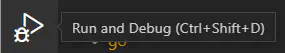
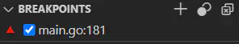
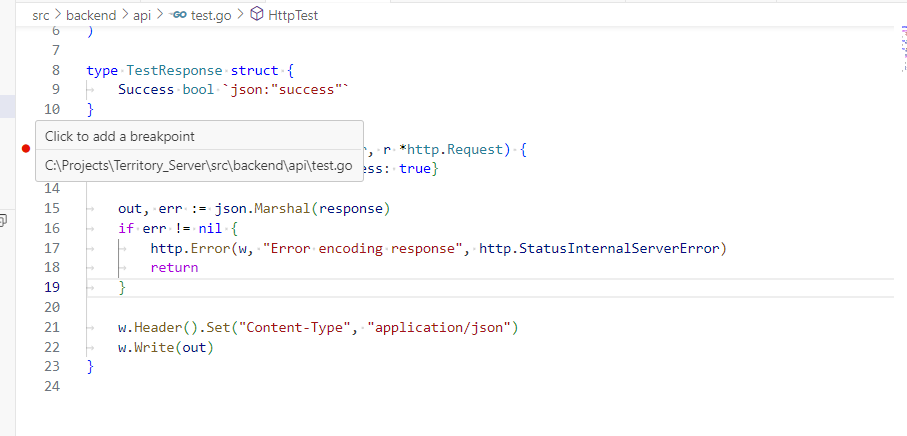
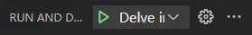

# 本地测试指导文档 - Territory

## 1. 项目简介

本项目是一个 MMO RTS 沙盒游戏的分布式服务端实现，允许玩家通过编程来控制自己的单位 AI。玩家通过编写代码来驱动游戏中的单位进行各种操作，如资源收集、战斗、建造等。每个玩家的代码将与其他玩家的 AI 代码并行运行，在一个持久化的游戏世界中进行交互。该项目提供了一个分布式、独立的游戏服务器，开发者可以在本地或互联网上部署自己的游戏世界。

本地测试文档旨在帮助开发者在本地计算机或局域网内快速启动服务器，并测试和调试自己的游戏 AI 代码。

## 2. 环境要求

为了在本地运行并测试该服务端项目，您需要确保以下环境和工具已正确配置：

* **操作系统**：仅支持 Windows 操作系统。请确保您的计算机运行的是 Windows 10 或更新版本。
* **编程语言**：Golang开发语言 （≥ 1.23.4）
* **依赖工具**:
  * **Git**：Git 用于版本控制，您可以从 GitHub 克隆项目仓库并管理项目的源代码。参考[官方文档](https://git-scm.com/book/zh/v2/%E8%B5%B7%E6%AD%A5-%E5%AE%89%E8%A3%85-Git)
  * **Docker**: 用于容器化部署和管理开发环境及服务（如数据库、缓存等）。请安装[*Docker Desktop*](https://www.docker.com/products/docker-desktop/)，并确保Docker引擎正在运行。
  * **Visual Studio Code**: Visual Studio Code 是推荐的编辑器，您可以用它来编写和调试Go代码。请参照`/.vscode/extension.json`安装建议插件

## 3. 安装与配置

### 3.1 克隆项目

从GitHub上克隆[Territory](https://github.com/TerritoryTeam/Territory_Server)项目到本地

```shell
git clone https://github.com/TerritoryTeam/Territory_Server.git
```

### 3.2 初始化Go环境

下载依赖资源，并复制到本地`vendor`目录中。

```shell
cd src
go mod tidy
go mod vendor
```

### 3.3 docker-compose启动服务

通过 docker-compose 一次性启动多个服务:

```shell
cd src
docker-compose up
```

> 在容器环境启动的情况下，我们可以通过构建并更新部分镜像来部署代码变更：
> ```shell
> docker-compose build --no-cache nakama
> ```

检查服务状态
```shell
cd src
docker-compose ps
```

## 4 使用Visual Studio Code调试器

在步骤**3.3**中，将默认默认使用调试镜像，并暴露`4000`端口用于远程调用**Delve**调试器

### 4.1 进入Run & Debug试图

在VS Code中，点击左侧活动栏中的**Run and Debug**，将进入调试试图。



### 4.2 设置中断点

* **设置模块加载阶段的中断点**
  
  如果你需要调试在模块加载时立即执行的代码（例如 `InitModule` 函数中的代码），你需要在Nakama加载模块之前设置断点:
  1. 在 VS Code 的调试面板中，找到 断点 部分。
  2. 点击 + 按钮 添加一个断点。
  3. 输入 `main.go:181`（或其他适当的行号），然后按 回车。
  

  > 这告诉 *VS Code* 在*Nakama* 的 `main.go` 文件的第 `181` 行（或你选择的其他行）设置一个断点。

* **设置自定义代码的中断点**：
  
  对于`Territory`正常代码的中断点，只需要在对应代码行，点击添加中断点即可。

  

### 4.3 启动调试器
  
  设置好断点后，点击 `Run and Debug` 视图顶部的 `Play` 按钮启动调试器。

  

  此时，*Nakama*应该会运行，并且*VS Code*会在你设置的断点处暂停。你可以在左侧的 `Variables` 中看到执行到 `main.go:181`的局部变量。
  
> 请忽略如下报错：
> ```bash
> Could not load source 'github.com/heroiclabs/nakama/v3/main.go': Unsupported command: cannot process "source"
> ```
> 这个消息只是 VS Code 告诉你它无法识别 Nakama 的 `main.go` 文件，因此无法显示当前调试代码。

## 5 使用Postman & API Explorer调测接口


